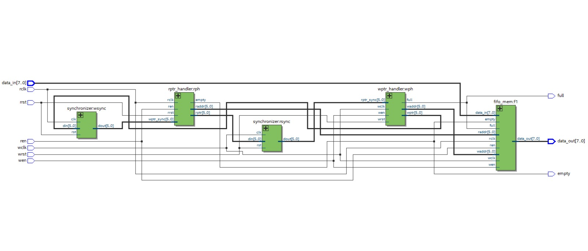
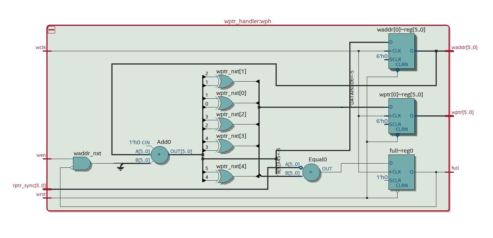
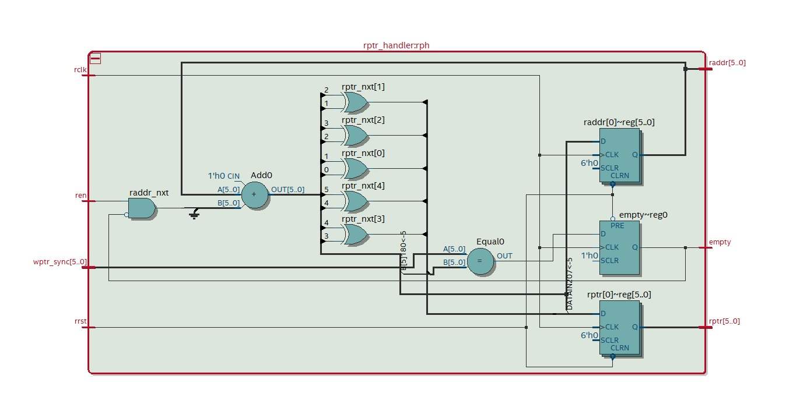
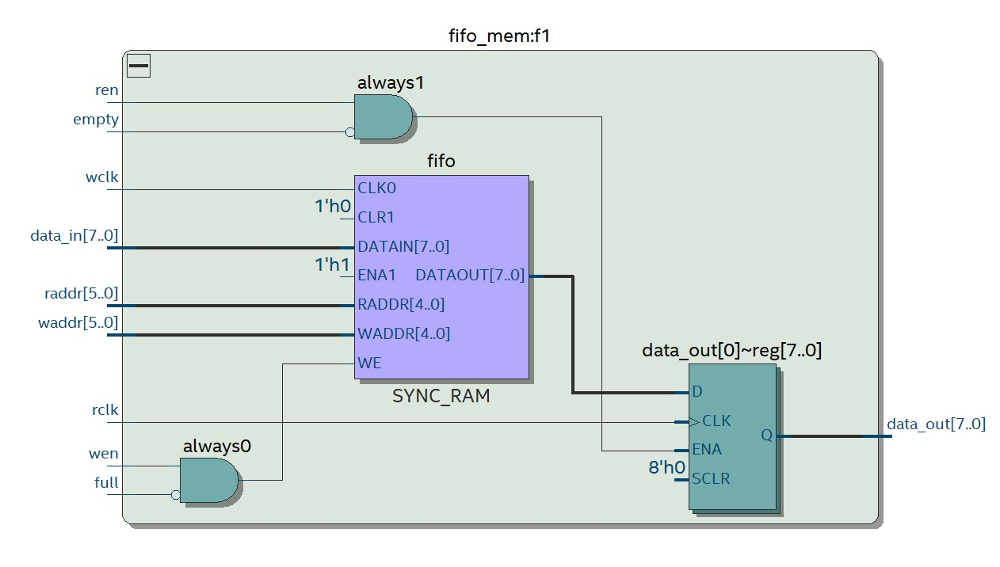
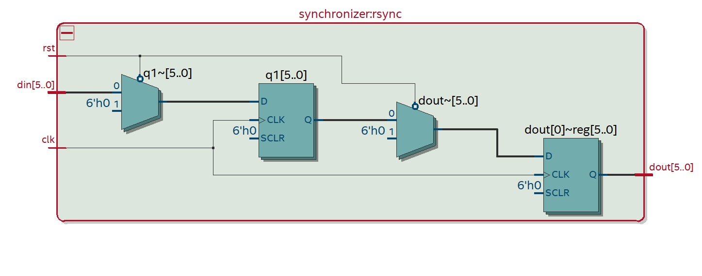
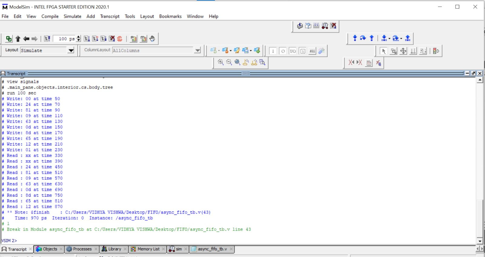
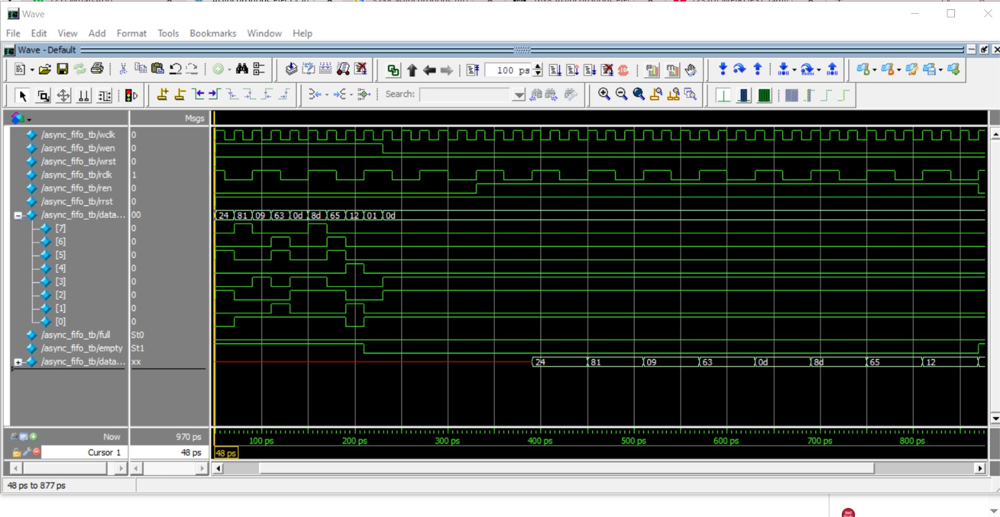

# Verilog Implementation of 32x8 Asynchronous FIFO

This project implements a 32x8 Asynchronous FIFO (First-In First-Out) memory using Verilog. Designed from scratch, this FIFO enables safe data transfer between two independent clock domains, integrating synchronization and metastability handling. Verified through ModelSim simulation, the project focuses on core digital design concepts that are foundational in hardware communication systems.

---

## 📑 Table of Contents

1. [Description](#description)  
2. [Key Concepts Learnt](#key-concepts-learnt)  
3. [Tools Used](#tools-used)  
4. [Screenshots of Output](#screenshots-of-output)  
5. [Contact](#contact)

---

## 📘 Description

An **Asynchronous FIFO** is a specialized memory buffer used to safely transfer data between subsystems that operate at different clock frequencies. Unlike synchronous FIFOs, asynchronous FIFOs manage clock domain crossing using Gray codes and synchronization logic, making them suitable for complex SoC and FPGA-based applications.

This 32-depth and 8-bit wide FIFO allows writing and reading on separate clocks (`wclk` and `rclk`) with full and empty detection logic. The project was built from the ground up to understand:
- How FIFO pointers are managed in different domains.
- How to ensure data stability during domain crossing.
- How to structure FIFO memory and control logic in Verilog.

---

## 🧠 Key Concepts Learnt

> "I’m excited to share my new project on Verilog implementation of a 32x8 asynchronous FIFO. It may sound like a basic project, but this was my journey of decoding logic from scratch, learning, failing, and debugging my way through."

By building the project independently, I strengthened my understanding of:
- ✅ Read/Write Pointer Management  
- ✅ Gray Code Conversion for Clock Domain Crossing  
- ✅ Full and Empty Detection Logic  
- ✅ Synchronization and Metastability Handling  
- ✅ Designing and Testing Asynchronous Logic in Verilog  
- ✅ Simulation and Waveform Debugging in ModelSim  

---

## 🔧 Tools Used

| Tool        | Description                              |
|-------------|------------------------------------------|
| **Verilog** | For RTL Design                           |
| **ModelSim**| For Simulation and Waveform Debugging    |
| **Git**     | Version Control                          |
| **Markdown**| Project Documentation                    |

---

## 📸 Screenshots of Output

### ✅ FIFO topmodule  

### ✅ FIFO Write Pointer Handler

### ✅ FIFO Read Pointer Handler

### ✅ FIFO Memory  

### ✅ Synchroniser  

### ✅ Transcript output  

### ✅ Output Waveform  

---

## 📬 Contact

Feel free to reach out for feedback, collaboration, or discussion:

**Vasantha Vidhya**  
📧 vasanthavidhyapv@email.com  
🔗 [LinkedIn]https://www.linkedin.com/in/vasantha-vidhya-3b53aa25a/

---

> *This project was a stepping stone to mastering asynchronous digital design. I'm eager to continue building more robust digital systems using Verilog HDL framework.*
